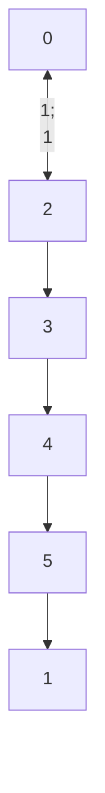

## 1466. (M) Reorder Routes to Make All Paths Lead to the City Zero

### `solution.py`
While the problem looks complicated at first glance, it is actually quite simple once we start examining it in further detail. The paths can be redirected by a simple graph traversal while checking whether an edge is pointed in the correct direction. If we start at city `0`, a traversed edge `[u,v]` is in the incorrect direction since it is directed away from the source. Thus, if that edge is in the list `connections` than we would have to redirect it.  
The implementation is also relatively simple, and it involves maintaining a `set` of the original directed edges. One thing to keep in mind is that the graph may have cycles, and thus we need to perform BFS instead of DFS in order to get the *minimum* number of redirections. For example, consider the graph:  

If the graph is traversed via DFS the total number of redirects would be 5, since it would walk along the cycle reversing every edge. By contrast a BFS traversal will yield 2 redirects as it would realize that edges `[5,1]` and `[4,5]` are already in the correct orientation and only reverse edges `[1,2]` and `[2,3]`.  

#### Conclusion
The time complexity is $O(|V|)$, where $|V|$ is the number of nodes in the graph. The space complexity is $O(|E|)$ where $|E|$ is the number of edges in `connections`.  
  

