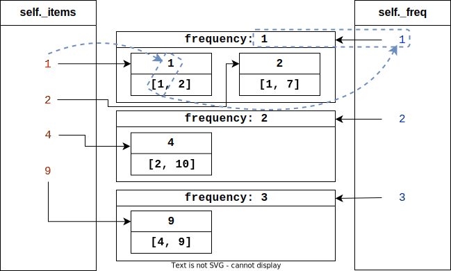

## 460. (H) LFU Cache

### `solution.py`
This problem is the advanced version of problem [#146 LRU Cache](https://leetcode.com/problems/lru-cache/), and introduces a frequency component on top of the LRU algorithm. We've already established that we can use Python's `collections.dict` to keep track of the access order of items, now we must figure out how to layer a system that keeps track of the number of times an item has been accessed. The problem asks us to implement `get()` and `put()` so that they take on average constant time - which tells us that we could use more dictionaries to maintain an item's access frequency.  
Here we can use 3 dictionaries; one with `key: key, value: [frequency, value]` and a nested dictionary with `key: frequency, value: dict(key: value, value: None)`. Python sets unfortunately do not keep track of insertion order, thus we use a dictionary instead with `None` as the values. In this configuration, we can access the value, frequency, and ordered set of items with the same frequency given an item's key in constant time (pictured in the diagram as a dotted blue line).  
  
  
  
When an item is accessed, we 'increment' its frequency by removing it from its current frequency set and adding it back to the appropriate one (eg. going from 1 to 2, remove item from `self._freq[1]` and add it to `self._freq[2]` and update `self._minfreq` if `self._freq[1]` is now empty). This also has the added bonus of updating the temporal component of the cache.  
Whenever the cache is at capacity and a new item needs to be added, we go to `self._freq[self._minfreq]` (items that have been *least frequently* used) and evict the left-most item in that dictionary (the item that was *least recently* used). Then we may simply add the new item with a frequency of 1 using the private method `_insert()`, updating `self._minfreq` as necessary.  
  
#### Conclusion
Adding the frequency component introduced a fair amount of complexity compared to the relatively simple LRU cache, but `get()` and `put()` operations still operate in average $O(1)$ time as we can key into dictionaries to access the information we need. In terms of space complexity, this solution uses $O(n)$ space where $n$ equals `capacity`. This is because the size of `self._items` and `self._freq` scales with the number of items in the cache, which will be equal to `capacity` in the worst case.  
  

