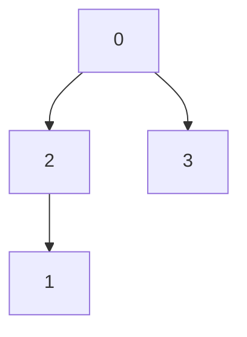

## 1443. (M) Minimum Time to Collect All Apples in a Tree

### `solution.py`
The main pitfall of this problem is taking the description at face value and treating it as a tree. While the inputs are *technically* [trees](https://en.wikipedia.org/wiki/Tree_(data_structure)), the node are not labeled in hierarchical order and solutions that do not keep this in mind will most likely fail (such as on inputs like `edges = [[0,3], [0,2], [1,2]]`).  

Thinking about the input as graphs rather than trees make things (at least to me) much easier to reason about. The first logical course of action is to collate the edges in an adjacency list (in this case using a dictionary) for easier access. For the traversal we know we want to use DFS since we want to count a valid edge just once. During traversal, we can see that the sum of the traversal costs of all subtrees plus the number of 'valid' subtrees are enough to compute the total cost at that specific node. We can keep track of this value globally since we never traverse an edge twice (line 22, `self.valid_edges`). Using this logic, we let the return value of the recursive function to be whether a node is part of a valid path. Then we return `hasApple[current]` in the base case (current node is a leaf) and the logical or of the recursive calls on all neighbors. In the recursive step we also increment `self.valid_edges` by 2 whenever we encounter a neighbor in a valid path, since the graph is acyclic which in turn means all edges will be traversed twice.  
  
#### Conclusion
This solution runs in $O(n)$ time, where $n$ is the number of nodes (adjacency list generation takes $O(E) = O(n-1)$ and traversal takes $O(n)$). In terms of memory it will use $O(n)$ space since the adjacency list scales to the number of edges.  
  

### `solution_2.py`
This solution is nearly identical to the first one except that it actually uses a list instead of a dictionary. We can do this because all nodes are sequentially labeled. Theoretically access operations for both lists and dictionaries takes $O(1)$ time. But practially indexing into a list is much more faster than looking values up in a dictionary since we don't have to deal with key hashing, collision handling, bucket traversal... etc (possibly relevant YouTube [video](https://www.youtube.com/watch?v=U16RnpV48KQ)).  
  
#### Conclusion
The time and space complexity is identical to the first solution, but runs faster and uses less memory in practice.  
  
