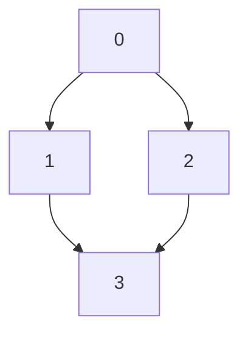

## 797. (Medium) All Paths From Source to Target

### `solution.py`

At first glance, this seems to be a rather trivial graph traversal problem - even more so considering the given conditions. A graph size of  `2 <= n <= 15` and being guaranteed that all elements in `graph[i]` are unique eliminates a lot of weird edge cases we that we would have had to handle. The given graphs being DAGs are also very nice since we don't have to deal with cycles at all.

With no cycles and a (relatively) small graph size we can solve this problem by naively traversing the entire graph. Both DFS and BFS would work in this case, but here I'm going to go with DFS (reimplementing this as BFS would be trivial anyway) using a `list` as a stack.

Now we need to figure out how to keep track of the previously traversed nodes. Here, simply remembering the entire path taken to reach a node would work given the maximum size of the graph. Instead of just pushing a node to the stack, we will push a tuple containing the path and the node.

The worst-case graph for this traversal method will look like multiple 'diamond' subgraphs chained together;

... and so on.
Each chain will double the number of paths, and 3 new nodes are introduced with each chain. Thus the time complexity is $O(2^(n/3))$.
The worst-case space complexity is $O(2^{n/3}\times((n/3+1)/2))$ since there are $O(2^{n/3})$ paths of length $n/3$ and each path requires bookkeeping of all paths up to the destination node, which is basically $1 + 2 + \dotsb + (n/3)$.

#### Conclusion
This is obviously, not optimal - and it only works because `n <= 15`.  There are multiple avenues of optimization that can be taken such as the utilization of backtracking (current solution re-traverses a path that is known to be valid) and better bookkeeping of visited nodes instead of simply remembering *all* paths to a certain node.
